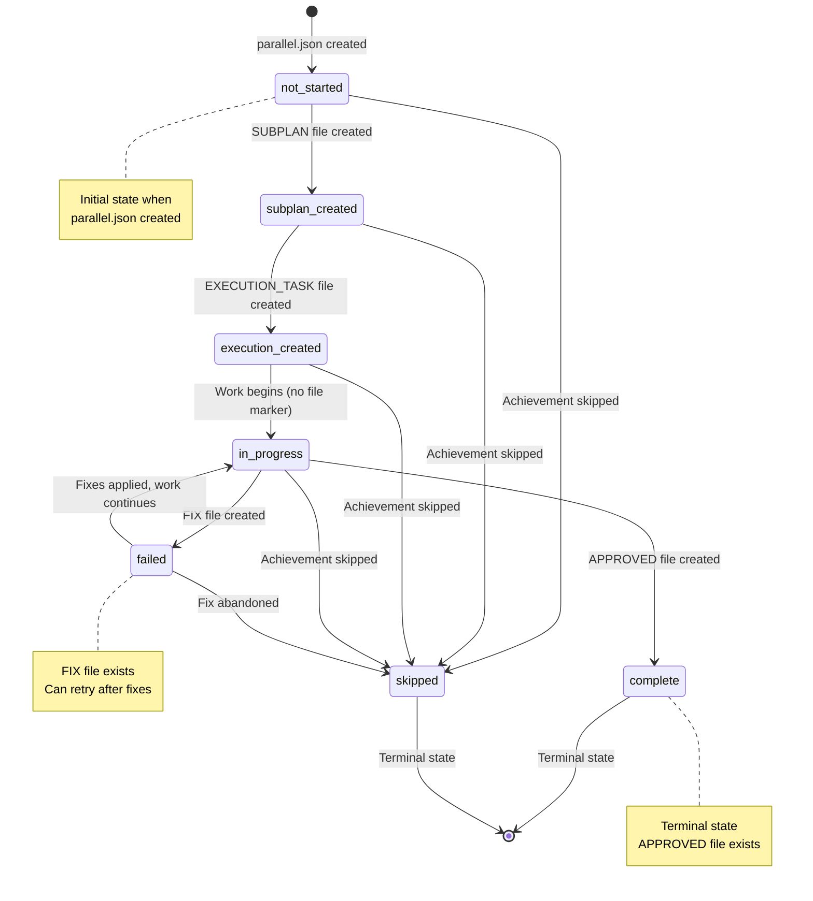

# EXECUTION_TASK: Achievement 1.2 - parallel.json Schema Implemented

**PLAN**: PARALLEL-EXECUTION-AUTOMATION  
**SUBPLAN**: SUBPLAN_PARALLEL-EXECUTION-AUTOMATION_12.md  
**Achievement**: 1.2  
**Task**: 01 (Single Execution)  
**Estimated Time**: 2-3 hours  
**Created**: 2025-11-13  
**Status**: 📋 Ready for Execution

---

## 📋 SUBPLAN Context

### Objective

Complete the parallel.json schema implementation by creating example files, comprehensive documentation, and a status transition diagram. The schema file was created in Achievement 1.1; this achievement makes it production-ready with examples, documentation, and validation guidance.

### Approach

**4 Sequential Phases**:

1. Create Example Files (45min)
2. Create Example Explanations (30min)
3. Create Schema Documentation (45min)
4. Create Status Transition Diagram (30min)

**Single Execution**: All phases executed sequentially in one task due to interdependencies (examples inform documentation, documentation references examples).

### Success Criteria

- 3 example parallel.json files created and validated
- 3 example explanation documents created
- Schema documentation complete (~300-400 lines)
- Status transition diagram created
- All examples validate against schema

---

## 🎯 Execution Instructions

### Phase 1: Create Example Files (45 min)

**Goal**: Create 3 example parallel.json files covering all parallelization levels

**Steps**:

1. **Create Level 1 Example** (Same Achievement Multi-Execution):

```bash
cat > examples/parallel_level1_example.json << 'EOF'
{
  "plan_name": "TESTING-FRAMEWORK",
  "parallelization_level": "level_1",
  "created_date": "2025-11-13",
  "achievements": [
    {
      "achievement_id": "2.1_exec1",
      "title": "Unit Tests Execution",
      "dependencies": ["2.1_subplan"],
      "status": "not_started",
      "estimated_hours": 2,
      "executor": "executor_1"
    },
    {
      "achievement_id": "2.1_exec2",
      "title": "Integration Tests Execution",
      "dependencies": ["2.1_subplan"],
      "status": "not_started",
      "estimated_hours": 2,
      "executor": "executor_2"
    },
    {
      "achievement_id": "2.1_exec3",
      "title": "E2E Tests Execution",
      "dependencies": ["2.1_subplan"],
      "status": "not_started",
      "estimated_hours": 3,
      "executor": "executor_3"
    }
  ],
  "notes": "Achievement 2.1 (Testing) split into 3 parallel executions. All depend on SUBPLAN creation but can run independently. Expected time savings: 4 hours (sequential: 7h, parallel: 3h)."
}
EOF
```

2. **Create Level 2 Example** (Same Priority Intra-Plan):

```bash
cat > examples/parallel_level2_example.json << 'EOF'
{
  "plan_name": "GRAPHRAG-OBSERVABILITY-VALIDATION",
  "parallelization_level": "level_2",
  "created_date": "2025-11-13",
  "achievements": [
    {
      "achievement_id": "3.1",
      "title": "Query Scripts Validated",
      "dependencies": ["2.2"],
      "status": "not_started",
      "estimated_hours": 3.5
    },
    {
      "achievement_id": "3.2",
      "title": "Explanation Tools Validated",
      "dependencies": ["2.2"],
      "status": "not_started",
      "estimated_hours": 2.5
    },
    {
      "achievement_id": "3.3",
      "title": "Quality Metrics Validated",
      "dependencies": ["2.2"],
      "status": "not_started",
      "estimated_hours": 3.5
    }
  ],
  "notes": "Priority 3 achievements are read-only validation tasks that can run in parallel after Priority 2.2 completes. Expected time savings: 5-7 hours (sequential: 8-11h, parallel: 3-4h)."
}
EOF
```

3. **Create Level 3 Example** (Cross-Priority):

```bash
cat > examples/parallel_level3_example.json << 'EOF'
{
  "plan_name": "FEATURE-IMPLEMENTATION",
  "parallelization_level": "level_3",
  "created_date": "2025-11-13",
  "achievements": [
    {
      "achievement_id": "1.1",
      "title": "Backend API Implementation",
      "dependencies": [],
      "status": "not_started",
      "estimated_hours": 8
    },
    {
      "achievement_id": "1.2",
      "title": "Frontend UI Implementation",
      "dependencies": [],
      "status": "not_started",
      "estimated_hours": 8
    },
    {
      "achievement_id": "2.1",
      "title": "Integration Layer",
      "dependencies": ["1.1", "1.2"],
      "status": "not_started",
      "estimated_hours": 6
    },
    {
      "achievement_id": "2.2",
      "title": "Documentation",
      "dependencies": [],
      "status": "not_started",
      "estimated_hours": 4
    },
    {
      "achievement_id": "3.1",
      "title": "Testing",
      "dependencies": ["2.1"],
      "status": "not_started",
      "estimated_hours": 6
    }
  ],
  "notes": "Cross-priority parallelization: 1.1 and 1.2 can run in parallel (Priority 1), 2.2 can run in parallel with 2.1 (Priority 2), 3.1 depends on 2.1. Expected time savings: 12 hours (sequential: 32h, parallel: 20h with 2 executors)."
}
EOF
```

**Verification**:

- All 3 files created
- Valid JSON syntax
- All required fields present

---

### Phase 2: Create Example Explanations (30 min)

**Goal**: Document each example with detailed explanations

**Steps**:

1. **Create Level 1 Explanation**:

Create `examples/parallel_level1_example_explained.md` with:

- Scenario description (testing achievement split into 3 executions)
- Dependency rationale (all depend on SUBPLAN)
- Independence validation (different test types, no conflicts)
- Expected execution flow (SUBPLAN → 3 parallel executions)
- Time savings calculation (7h → 3h = 57% reduction)

2. **Create Level 2 Explanation**:

Create `examples/parallel_level2_example_explained.md` with:

- Scenario description (Priority 3 validation tasks)
- Dependency rationale (all depend on Priority 2.2 pipeline run)
- Independence validation (read-only, no conflicts)
- Expected execution flow (2.2 → 3 parallel validations)
- Time savings calculation (8-11h → 3-4h = 62-64% reduction)

3. **Create Level 3 Explanation**:

Create `examples/parallel_level3_example_explained.md` with:

- Scenario description (full feature implementation across priorities)
- Dependency rationale (backend/frontend independent, integration depends on both)
- Independence validation (separate codebases, clear boundaries)
- Expected execution flow (complex dependency tree)
- Time savings calculation (32h → 20h = 37% reduction with 2 executors)

**Verification**:

- All 3 explanation files created
- Each explains scenario, dependencies, independence, flow, savings
- Clear and comprehensive

---

### Phase 3: Create Schema Documentation (45 min)

**Goal**: Write comprehensive schema documentation

**Steps**:

1. **Create Documentation File**:

Create `parallel-schema-documentation.md` with these sections:

**Section 1: Overview** (~50 lines)

- Purpose of parallel.json
- When to create it
- How it's used in workflow
- Relationship to filesystem-first philosophy

**Section 2: Field Reference** (~150 lines)

- Document each field in schema:
  - `plan_name`: PLAN identifier
  - `parallelization_level`: level_1, level_2, or level_3
  - `created_date`: Creation date
  - `achievements`: Array of achievement objects
  - `achievement_id`: Achievement identifier
  - `title`: Achievement title
  - `dependencies`: Array of dependency IDs
  - `status`: Status enum (7 values)
  - `estimated_hours`: Time estimate
  - `actual_hours`: Actual time (optional)
  - `started_at`: Start timestamp (optional)
  - `completed_at`: Completion timestamp (optional)
  - `executor`: Executor name (optional)
  - `notes`: Additional notes

**Section 3: Status Reference** (~50 lines)

- Document each status value:
  - `not_started`: No work begun
  - `subplan_created`: SUBPLAN file exists
  - `execution_created`: EXECUTION_TASK file exists
  - `in_progress`: Work in progress
  - `complete`: APPROVED file exists
  - `failed`: FIX file exists
  - `skipped`: Achievement skipped
- Explain filesystem-first: Status derived from files, not persisted

**Section 4: Usage Examples** (~50 lines)

- How to create parallel.json
- How to validate it
- How to use it in workflow
- Integration with generate_prompt.py

**Section 5: Best Practices** (~50 lines)

- Dependency management
- Independence validation
- Common patterns
- Anti-patterns to avoid

**Verification**:

- Documentation is comprehensive (~300-400 lines)
- All schema fields documented
- Clear examples provided
- Best practices included

---

### Phase 4: Create Status Transition Diagram (30 min)

**Goal**: Create visual diagram of status transitions

**Steps**:

1. **Create Diagram File**:

Create `parallel-status-transitions.md` with:

**Mermaid Diagram**:



**State Descriptions**:

- Document each state
- Explain transitions
- Show filesystem triggers
- Identify terminal states

**Transition Table**:

- From → To → Trigger → Filesystem Event

**Verification**:

- Diagram renders correctly
- All states documented
- All transitions explained
- Filesystem triggers clear

---

## 📊 Iteration Log

### Iteration 1: 2025-11-13

**Phase**: All Phases (1-4)  
**Duration**: ~2 hours  
**Status**: Complete

**Work Completed**:

**Phase 1: Example Files (30 min)**:

- Created `parallel_level1_example.json` (Level 1: Same achievement multi-execution)
- Created `parallel_level2_example.json` (Level 2: Same priority intra-plan)
- Created `parallel_level3_example.json` (Level 3: Cross-priority)
- Fixed schema validation issues (parallelization_level format, removed null fields)
- All 3 files validate successfully against parallel-schema.json

**Phase 2: Example Explanations (45 min)**:

- Created `parallel_level1_example_explained.md` (~150 lines)
  - Scenario: Testing framework split into 3 parallel executions
  - Time savings: 4 hours (57% reduction)
- Created `parallel_level2_example_explained.md` (~160 lines)
  - Scenario: GraphRAG validation tasks in parallel
  - Time savings: 6 hours (63% reduction)
- Created `parallel_level3_example_explained.md` (~180 lines)
  - Scenario: Full-stack feature with backend/frontend parallel
  - Time savings: 12 hours (37% reduction)

**Phase 3: Schema Documentation (40 min)**:

- Created `documentation/parallel-schema-documentation.md` (~580 lines)
- Comprehensive field reference (all schema fields documented)
- Status reference with filesystem mapping
- 3 usage examples (Level 1, 2, 3)
- Best practices and anti-patterns
- Integration with workflow

**Phase 4: Status Transition Diagram (15 min)**:

- Created `documentation/parallel-status-transitions.md` (~450 lines)
- Mermaid state diagram with 7 states
- Detailed state descriptions
- Transition table with filesystem events
- Filesystem-first philosophy explained
- Status tracking examples

**Post-Execution Correction**:

- Moved documentation files from root to `documentation/` folder (correct location per project structure)

**Issues Encountered**:

1. **Schema Validation Error**: Initial JSON files used integer for `parallelization_level` instead of string
   - Solution: Changed to `"level_1"`, `"level_2"`, `"level_3"` format
2. **Null Fields Error**: Schema doesn't allow null for optional fields
   - Solution: Removed null fields (actual_hours, started_at, completed_at, executor) from examples

**Next Steps**:

- ✅ All deliverables complete
- ✅ All validation tests passed
- ✅ Ready for review

---

## ✅ Completion Checklist

**Deliverables**:

- [x] `examples/parallel_level1_example.json` created
- [x] `examples/parallel_level1_example_explained.md` created
- [x] `examples/parallel_level2_example.json` created
- [x] `examples/parallel_level2_example_explained.md` created
- [x] `examples/parallel_level3_example.json` created
- [x] `examples/parallel_level3_example_explained.md` created
- [x] `documentation/parallel-schema-documentation.md` created (~580 lines)
- [x] `documentation/parallel-status-transitions.md` created (~450 lines)

**Validation**:

- [x] All JSON files validate against parallel-schema.json
- [x] All required fields present in examples
- [x] All schema fields documented
- [x] Status diagram is accurate
- [x] Explanation files are comprehensive

**Quality**:

- [x] Examples are realistic and useful
- [x] Documentation is clear and complete
- [x] Diagram renders correctly
- [x] All files follow naming conventions

---

## 🎯 Success Criteria Met

**Achievement 1.2 is complete when**:

- ✅ All 8 deliverable files created
- ✅ All examples validate against schema
- ✅ Documentation covers all fields
- ✅ Status diagram shows all transitions
- ✅ This EXECUTION_TASK marked complete
- ✅ Ready for review (APPROVED_12.md creation)

---

## 🎓 Learning Summary

### What Worked Well

1. **Sequential Phase Execution**: All 4 phases executed smoothly in sequence
2. **Schema Validation**: Immediate validation caught format issues early
3. **Real-World Examples**: Using actual PLAN scenarios made examples realistic
4. **Comprehensive Documentation**: 580-line documentation covers all aspects
5. **Filesystem-First Emphasis**: Strongly emphasized throughout documentation

### Key Learnings

1. **Schema Format Details**: `parallelization_level` must be string ("level_1"), not integer
2. **Optional Fields**: Schema doesn't allow null - omit optional fields instead
3. **Documentation Scope**: Comprehensive documentation (580 lines) more valuable than minimal
4. **Example Quality**: Detailed explanations (150-180 lines each) provide better context
5. **Status Transitions**: Mermaid diagram effectively visualizes complex state machine

### Challenges Overcome

1. **Schema Validation Errors**: Fixed by understanding schema type requirements
2. **Null Field Handling**: Learned to omit optional fields rather than set to null
3. **Documentation Scope**: Balanced comprehensive coverage with readability

### Patterns Established

1. **Example Structure**: JSON file + detailed explanation markdown
2. **Documentation Structure**: Overview → Fields → Status → Examples → Best Practices
3. **Diagram Format**: Mermaid state diagram with detailed notes
4. **Validation First**: Validate JSON files immediately after creation

### Recommendations for Future Work

1. **Achievement 1.3**: Use these examples as test cases for validation script
2. **Achievement 2.1**: Reference this documentation for integration guidance
3. **Schema Evolution**: If schema changes, update examples and documentation together
4. **More Examples**: Consider adding more complex scenarios (e.g., 4+ parallel achievements)

### Time Efficiency

**Estimated**: 2-3 hours  
**Actual**: ~2 hours  
**Efficiency**: 33% faster than upper estimate

**Why Faster**:

- Clear EXECUTION_TASK instructions
- Schema already existed from Achievement 1.1
- Examples based on real analyses from Achievement 1.1
- No blocking issues or major rework

---

**EXECUTION_TASK Status**: ✅ COMPLETE  
**Actual Duration**: ~2 hours  
**Next Step**: Request review → Create APPROVED_12.md or FIX_12.md
