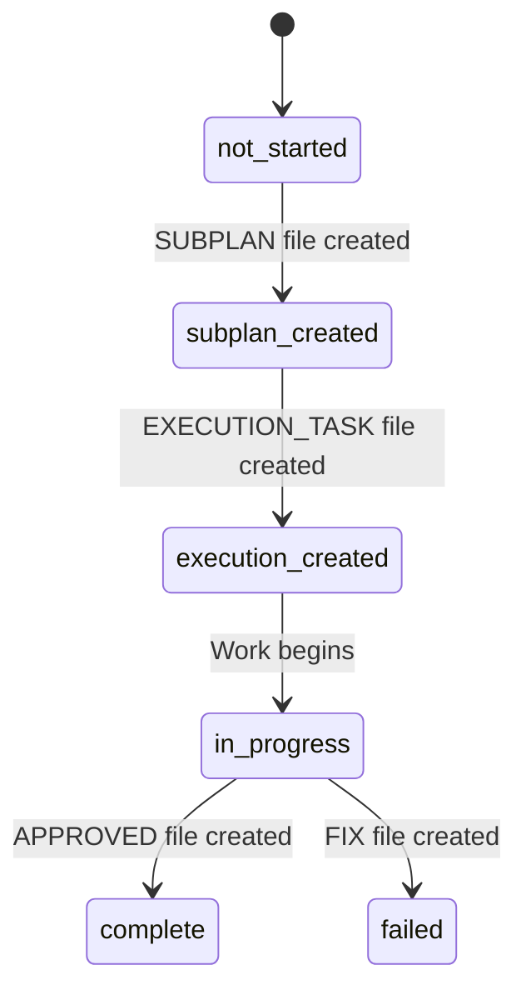

# SUBPLAN: Achievement 1.2 - parallel.json Schema Implemented

**PLAN**: PARALLEL-EXECUTION-AUTOMATION  
**Achievement**: 1.2  
**Estimated Time**: 2-3 hours  
**Created**: 2025-11-13  
**Status**: 📋 Design Phase

---

## 🎯 Objective

Complete the parallel.json schema implementation by creating example files, comprehensive documentation, and a status transition diagram. The schema file (`parallel-schema.json`) was created in Achievement 1.1; this achievement focuses on making it production-ready with examples, documentation, and validation guidance.

**Core Purpose**: Provide complete schema implementation with working examples, clear documentation, and visual status flow to enable Achievement 1.3 (validation script) and Achievement 2.1 (parallel workflow integration).

**Success Definition**: A fully documented schema with 3 working example files covering all parallelization levels, comprehensive documentation explaining all fields and usage patterns, and a clear status transition diagram.

---

## 📦 Deliverables

### 1. Example parallel.json Files (3 files)

**Files**:

- `examples/parallel_level1_example.json` - Same achievement multi-execution
- `examples/parallel_level2_example.json` - Same priority intra-plan
- `examples/parallel_level3_example.json` - Cross-priority

**Contents**: Each example demonstrates:

- Valid JSON structure matching schema
- Realistic achievement dependencies
- All required fields populated
- Optional fields demonstrated
- Comments explaining structure (in accompanying .md files)

**Size**: ~30-50 lines each

### 2. Schema Documentation

**File**: `parallel-schema-documentation.md`

**Contents**:

- Schema overview and purpose
- Field-by-field documentation
- Status enum explanation
- Usage examples for each parallelization level
- Best practices
- Common patterns
- Validation guidance

**Size**: ~300-400 lines

### 3. Status Transition Diagram

**File**: `parallel-status-transitions.md`

**Contents**:

- Visual diagram of status transitions
- State descriptions
- Transition triggers (filesystem events)
- Terminal states
- Error states
- Mermaid diagram format

**Size**: ~100-150 lines

### 4. Example Explanations

**Files**:

- `examples/parallel_level1_example_explained.md`
- `examples/parallel_level2_example_explained.md`
- `examples/parallel_level3_example_explained.md`

**Contents**: For each example:

- Scenario description
- Dependency rationale
- Independence validation
- Expected execution flow
- Time savings calculation

**Size**: ~100-150 lines each

---

## 🔧 Approach

### Phase 1: Create Example Files (45 min)

**Goal**: Create 3 example parallel.json files covering all parallelization levels

**Tasks**:

1. **Level 1 Example** (Same Achievement Multi-Execution):

   - Scenario: Achievement with 3 independent execution tasks
   - Dependencies: All depend on SUBPLAN creation
   - Example: Testing achievement split into unit tests, integration tests, e2e tests

2. **Level 2 Example** (Same Priority Intra-Plan):

   - Scenario: 3 achievements in same priority that can run in parallel
   - Dependencies: Some achievements depend on others
   - Example: Priority 3 with independent polish tasks

3. **Level 3 Example** (Cross-Priority):
   - Scenario: Achievements across priorities with complex dependencies
   - Dependencies: Cross-priority dependencies
   - Example: Full PLAN with parallelization opportunities

**Output**: 3 valid JSON files

### Phase 2: Create Example Explanations (30 min)

**Goal**: Document each example with detailed explanations

**Tasks**:

1. For each example, create explanation document:
   - Describe the scenario
   - Explain dependency choices
   - Show independence validation
   - Calculate time savings
   - Provide execution guidance

**Output**: 3 explanation markdown files

### Phase 3: Create Schema Documentation (45 min)

**Goal**: Write comprehensive schema documentation

**Tasks**:

1. **Overview Section**:

   - Purpose of parallel.json
   - When to create it
   - How it's used

2. **Field Documentation**:

   - Document each field in schema
   - Explain required vs optional
   - Show example values
   - Explain constraints

3. **Status Documentation**:

   - Explain each status value
   - Document transitions
   - Explain filesystem-first philosophy

4. **Usage Examples**:

   - Show how to create parallel.json
   - Show how to read it
   - Show how to validate it

5. **Best Practices**:
   - Dependency management
   - Independence validation
   - Common patterns
   - Anti-patterns

**Output**: Comprehensive documentation file

### Phase 4: Create Status Transition Diagram (30 min)

**Goal**: Create visual diagram of status transitions

**Tasks**:

1. **Design Diagram**:

   - Identify all states
   - Map transitions
   - Show triggers (filesystem events)
   - Mark terminal states

2. **Create Mermaid Diagram**:

   - Use Mermaid syntax
   - Clear labels
   - Color coding for state types

3. **Document Transitions**:
   - Explain each transition
   - Document triggers
   - Show examples

**Output**: Status transition diagram document

---

## 🎯 Execution Strategy

### Single Execution Approach

**Rationale**: All deliverables are documentation/examples that build on each other. The schema file already exists from Achievement 1.1, so this achievement focuses on making it usable through examples and documentation.

**Execution Plan**:

- **Single EXECUTION_TASK**: `EXECUTION_TASK_PARALLEL-EXECUTION-AUTOMATION_12_01.md`
- **Approach**: Sequential phase execution (1→2→3→4)
- **Duration**: 2-3 hours (as estimated)

**Why Not Multiple Executions**:

- Examples inform documentation
- Documentation references examples
- Diagram references status from documentation
- Context continuity is valuable
- Small scope (2-3 hours total)

### Execution Order

**Phase Sequence**:

1. Create Examples (foundation)
2. Explain Examples (context)
3. Document Schema (comprehensive guide)
4. Create Diagram (visual reference)

**Dependencies**:

- Phase 2 depends on Phase 1 (need examples to explain)
- Phase 3 references Phases 1 and 2 (examples in documentation)
- Phase 4 references Phase 3 (status definitions)

---

## 🧪 Testing Requirements

### Validation Tests

**JSON Schema Validation**:

1. Validate each example file against schema
2. Verify all required fields present
3. Verify field types match schema
4. Verify enum values are valid

**Success Criteria**:

- All 3 example files validate successfully
- No schema errors
- All fields conform to types

### Documentation Quality

**Manual Review**:

1. Documentation is clear and comprehensive
2. All fields documented
3. Examples are realistic
4. Diagram is accurate

**Success Criteria**:

- Documentation covers all schema fields
- Examples demonstrate all parallelization levels
- Diagram shows all status transitions

### Integration Check

**Verify with Achievement 1.1**:

1. Examples use schema from 1.1
2. Examples match prompt builder output format
3. Status values align with filesystem-first philosophy

**Success Criteria**:

- Examples are compatible with parallel_prompt_builder.py output
- Status values match those in prompt templates
- Filesystem-first philosophy consistently applied

---

## 📊 Expected Results

### Deliverable Checklist

**Files Created**:

- ✅ `examples/parallel_level1_example.json` (~30-50 lines)
- ✅ `examples/parallel_level1_example_explained.md` (~100-150 lines)
- ✅ `examples/parallel_level2_example.json` (~30-50 lines)
- ✅ `examples/parallel_level2_example_explained.md` (~100-150 lines)
- ✅ `examples/parallel_level3_example.json` (~30-50 lines)
- ✅ `examples/parallel_level3_example_explained.md` (~100-150 lines)
- ✅ `parallel-schema-documentation.md` (~300-400 lines)
- ✅ `parallel-status-transitions.md` (~100-150 lines)

**Total**: 8 files, ~900-1,200 lines

### Functional Outcomes

**Example Files**:

- ✅ 3 valid JSON files covering all parallelization levels
- ✅ All examples validate against schema
- ✅ Realistic dependency structures
- ✅ All required and optional fields demonstrated

**Documentation**:

- ✅ Comprehensive field documentation
- ✅ Clear usage examples
- ✅ Best practices documented
- ✅ Anti-patterns identified

**Status Diagram**:

- ✅ Visual representation of status transitions
- ✅ All states documented
- ✅ Transition triggers explained
- ✅ Filesystem-first philosophy illustrated

### Integration Outcomes

**Ready for Achievement 1.3**:

- ✅ Schema is fully documented for validation script
- ✅ Examples provide test cases for validation
- ✅ Status transitions guide status detection logic

**Ready for Achievement 2.1**:

- ✅ Examples show how to create parallel.json
- ✅ Documentation guides integration
- ✅ Status diagram clarifies workflow

---

## 🎯 Success Criteria

### Must Have (Blocking)

1. **3 Example Files**: All 3 parallelization levels covered with valid JSON
2. **Schema Validation**: All examples validate against parallel-schema.json
3. **Comprehensive Documentation**: All schema fields documented with examples
4. **Status Diagram**: Visual diagram showing all status transitions
5. **Example Explanations**: Each example has detailed explanation document

### Should Have (Important)

1. **Best Practices**: Documentation includes best practices section
2. **Anti-Patterns**: Common mistakes documented
3. **Usage Examples**: Clear examples of how to use schema
4. **Realistic Scenarios**: Examples based on real PLAN patterns
5. **Clear Diagrams**: Mermaid diagrams render correctly

### Nice to Have (Optional)

1. **Additional Examples**: More than 3 examples
2. **Validation Script Preview**: Hints for Achievement 1.3 implementation
3. **Integration Guidance**: Tips for Achievement 2.1 integration

---

## 🚧 Risks and Mitigations

### Risk 1: Example Complexity

**Risk**: Examples may be too complex or too simple

**Likelihood**: Medium  
**Impact**: Medium (affects usability)

**Mitigation**:

- Base examples on real PLAN analyses from Achievement 1.1
- Start simple, add complexity as needed
- Include both simple and complex examples

**Contingency**: Simplify examples if too complex, add detail if too simple

### Risk 2: Documentation Completeness

**Risk**: Documentation may miss important fields or use cases

**Likelihood**: Low  
**Impact**: Medium (affects Achievement 1.3)

**Mitigation**:

- Use schema file as checklist (document every field)
- Reference Achievement 1.1 prompt templates
- Include usage examples for each field

**Contingency**: Update documentation based on Achievement 1.3 needs

### Risk 3: Status Diagram Accuracy

**Risk**: Diagram may not match actual filesystem-first implementation

**Likelihood**: Low  
**Impact**: High (misleading documentation)

**Mitigation**:

- Base diagram on existing filesystem-first patterns
- Reference Achievement 2.8 (methodology templates)
- Validate against get_achievement_status() function

**Contingency**: Update diagram to match actual implementation

### Risk 4: Schema Changes

**Risk**: Schema from Achievement 1.1 may need updates

**Likelihood**: Low  
**Impact**: Medium (requires rework)

**Mitigation**:

- Review schema before creating examples
- Validate examples against schema
- Document any needed changes

**Contingency**: Update schema if critical issues found, document in EXECUTION_TASK

---

## 📝 Notes and Considerations

### Design Decisions

**1. Examples Based on Real PLANs**

- **Decision**: Use GRAPHRAG and PROMPT-GENERATOR analyses from Achievement 1.1 as basis
- **Rationale**: Realistic examples are more valuable than synthetic ones
- **Trade-off**: May be more complex, but more useful

**2. Mermaid Diagram Format**

- **Decision**: Use Mermaid for status transition diagram
- **Rationale**: Renders in markdown, version-controllable, widely supported
- **Trade-off**: Limited styling, but sufficient for our needs

**3. Separate Explanation Files**

- **Decision**: Create separate .md files to explain each JSON example
- **Rationale**: JSON doesn't support comments, separate files provide context
- **Trade-off**: More files, but clearer separation

**4. Filesystem-First Emphasis**

- **Decision**: Strongly emphasize that status is derived, not persisted
- **Rationale**: Critical for Achievement 1.3 and 2.1 implementation
- **Trade-off**: May seem repetitive, but prevents misunderstanding

### Implementation Patterns

**Example Structure**:

```json
{
  "plan_name": "EXAMPLE-PLAN",
  "parallelization_level": "level_2",
  "created_date": "2025-11-13",
  "achievements": [
    {
      "achievement_id": "3.1",
      "title": "Achievement Title",
      "dependencies": ["2.3"],
      "status": "not_started",
      "estimated_hours": 3
    }
  ],
  "notes": "Explanation of parallelization strategy"
}
```

**Documentation Structure**:

1. Overview
2. Field Reference
3. Status Reference
4. Usage Examples
5. Best Practices
6. Common Patterns

**Diagram Structure**:



### Future Enhancements

**Not in Scope for 1.2** (defer to future work):

1. Automated example generation
2. Interactive schema explorer
3. Validation script (Achievement 1.3)
4. Integration with generate_prompt.py (Achievement 2.1)

**Rationale**: Focus on foundational documentation and examples. Advanced features come later.

### Dependencies

**Depends On**:

- Achievement 1.1 (needs parallel-schema.json and example analyses)

**Blocks**:

- Achievement 1.3 (needs schema documentation and examples)
- Achievement 2.1 (needs schema and examples for integration)

**Critical Path**: This achievement is on the critical path - must complete before 1.3 or 2.1.

---

## 🔄 Execution Workflow

### For Executor

**Step 1: Read This SUBPLAN**

- Understand objective and deliverables
- Review example structure
- Note documentation requirements

**Step 2: Read EXECUTION_TASK**

- File: `EXECUTION_TASK_PARALLEL-EXECUTION-AUTOMATION_12_01.md`
- Follow phase-by-phase instructions
- Track progress in iteration log

**Step 3: Execute Phases Sequentially**

- Phase 1: Create Example Files (45min)
- Phase 2: Create Example Explanations (30min)
- Phase 3: Create Schema Documentation (45min)
- Phase 4: Create Status Transition Diagram (30min)

**Step 4: Validate Deliverables**

- Validate all JSON files against schema
- Verify documentation completeness
- Check diagram accuracy

**Step 5: Update EXECUTION_TASK**

- Mark phases complete
- Document any issues or learnings
- Update status to "Complete"

**Step 6: Request Review**

- Notify reviewer that work is complete
- Provide summary of deliverables
- Highlight any deviations from SUBPLAN

---

## ✅ Definition of Done

**Achievement 1.2 is complete when**:

1. ✅ 3 example parallel.json files created and validated
2. ✅ 3 example explanation documents created
3. ✅ Schema documentation created (~300-400 lines)
4. ✅ Status transition diagram created
5. ✅ All examples validate against schema
6. ✅ All schema fields documented
7. ✅ All deliverables listed in "Expected Results" section exist
8. ✅ EXECUTION_TASK marked complete with iteration log
9. ✅ APPROVED_12.md created after review

**Ready for Next Achievement**: Achievement 1.3 (Validation Script) can start immediately after 1.2 is approved, as it depends on the schema and examples from 1.2.

---

**SUBPLAN Status**: 📋 Ready for Execution  
**Next Step**: Create EXECUTION_TASK_PARALLEL-EXECUTION-AUTOMATION_12_01.md  
**Estimated Duration**: 2-3 hours
